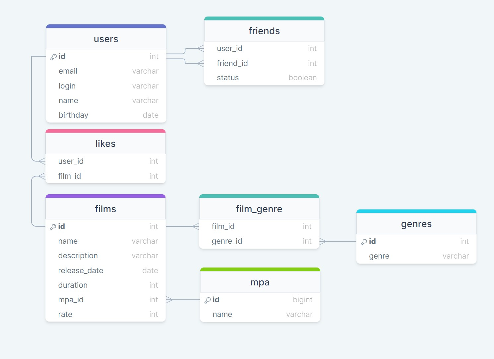

### java-filmorate
Схема базы данных:


#### Примеры запросов:

* Получение списка пользователей:
```
SELECT *
FROM users
```

* Получение одного пользователя по id (?? - id пользователя):
```
SELECT *
FROM users
WHERE user_id = ??;
```

* Получение друзей пользователя (n - id пользователя):
```
SELECT friend_id
FROM friends
WHERE user_id = n;
```

* Получение списка общих друзей с другим пользователем:
```
SSELECT friend_id
FROM friends
WHERE user_id = n
AND user_id = m
GROUP BY friend_id;
```

* Получение списка всех фильмов:
```
SELECT *
FROM films
```

* Получение одного фильма (n - id фильма):
```
SELECT *
FROM films
WHERE film_id = n;
```

* Получение ТОП-10 фильмов:
```
SELECT name
FROM films
WHERE film_id
   in (SELECT film_id
      FROM like
      GROUP BY film_id
      ORDER BY COUNT(film_id) DESC
      LIMIT 10);
```